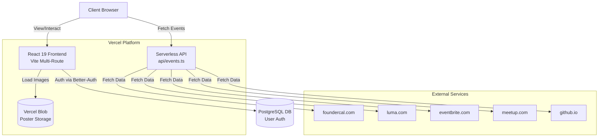

<div align="center">

</div>

# The Startup Tales

The Startup Tales is a modern React application for discovering, viewing, and organizing startup events across various cities. Built with Vite, Tailwind CSS, and Leaflet, the platform features a highly interactive map, seamless authentication, and serverless data fetching.

## 🚀 Features

- **Interactive Maps**: Browse events visually on a geographic map powered by Leaflet, React-Leaflet, and MapLibre.
- **Dynamic Event Discovery**: Fetches real-time startup events from external APIs using Vercel Edge functions.
- **Poster Scraping & Storage**: Automatically scrapes event posters and stores them securely in Vercel Blob storage.
- **Authentication**: Secure sign-up and sign-in flows powered by Better-Auth and PostgreSQL.
- **Modern UI**: Styled with Tailwind CSS and enhanced with smooth animations using Framer Motion.
- **Responsive Design**: Works seamlessly across desktops, tablets, and mobile devices.

## 🛠️ Tech Stack

- **Frontend**: React 19, React Router v7, Vite
- **Styling**: Tailwind CSS v4, Framer Motion, Lucide React
- **Mapping**: Leaflet, React-Leaflet, MapLibre GL
- **Backend / API**: Express, Vercel Serverless Functions
- **Database / Auth**: PostgreSQL (`pg`), Better-Auth
- **Storage**: Vercel Blob

## 🏛️ Architecture & System Design



The Startup Tales employs a modern serverless architecture designed for performance, scalability, and ease of deployment.

### Frontend Architecture
The frontend is built with **React 19** and **Vite**, utilizing a multi-route structure.
- **Routing**: Client-side routing is handled by `react-router-dom`, managing distinct paths (like `/`, `/events`, and `/pitch-circuit`) to provide fast, seamless transitions between pages without full page reloads.
- **Mapping System**: The core interactive element is the map, which utilizes `leaflet` and `react-leaflet` to render geographical data, while `react-leaflet-cluster` handles marker clustering for performance when displaying hundreds of events. `maplibre-gl` provides high-performance vector rendering where applicable.
- **UI & Animations**: The application utilizes **Tailwind CSS v4** for utility-first responsive styling and `framer-motion` for complex page transitions and micro-interactions, ensuring a premium user experience.

### API & Data Aggregation Layer
Instead of a traditional monolithic backend, the platform leverages **Vercel Serverless Functions** (`api/events.ts`).
- **Data Aggregation**: The serverless API fetches and normalizes event data from external sources (e.g., `foundercal.com`, `luma.com`, `eventbrite.com`, `meetup.com` and `github.io` endpoints) on-the-fly.
- **Edge Caching**: To prevent hitting external API rate limits and to ensure fast load times, the serverless endpoint utilizes Edge Caching (`Cache-Control: s-maxage=3600, stale-while-revalidate`). This ensures subsequent requests within an hour are served instantly from Vercel's global CDN.

### Build-Time Automation (Web Scraping)
A unique aspect of the system design is the build-time poster scraping mechanism (`scripts/scrape-posters.js`).
- **Pre-computation**: Before Vite starts the development server or builds for production, the Node.js script fetches the aggregate event list.
- **HTML Parsing & Blob Storage**: It uses lightweight Regex to parse `og:image` meta tags from event registration pages, bypassing the need for heavy headless browsers. Downloaded images are automatically uploaded to **Vercel Blob** storage.
- **Rate-Limiting Resilience**: The script implements manual throttling (`sleep`) to avoid triggering anti-bot protections on target websites. The output is a static `src/data/posters.json` file used by the frontend to display images synchronously.

### Authentication & Database
User authentication is managed by **Better-Auth**, which provides secure, session-based sign-in and sign-up flows. It interfaces directly with a **PostgreSQL** database (via the `pg` driver) to persist user accounts safely.

## 📦 Project Structure

```text
the-startup-tales/
├── api/                  # Vercel serverless functions (e.g., event fetching)
├── public/               # Static assets
├── scripts/              # Build scripts (e.g., scrape-posters.js)
├── src/                  # React frontend source code
│   ├── assets/           # Images, icons, fonts
│   ├── components/       # Reusable UI components
│   ├── data/             # Generated JSON data files
│   ├── lib/              # Utility libraries and integrations
│   ├── pages/            # Application routes/pages
│   └── utils/            # Helper functions
├── vercel.json           # Vercel deployment configuration
├── vite.config.ts        # Vite configuration
└── package.json          # Dependencies and scripts
```

## ⚙️ Prerequisites

- **Node.js** (v18 or higher recommended)
- **npm** (or yarn)
- **PostgreSQL Database** (for authentication/users)
- **Vercel Account** (for Blob storage and deployment)
- **Gemini API Key** (if utilizing AI features)

## 🔑 Environment Variables

Create a `.env.local` file in the root of the project and configure the following variables:

```env
# Gemini API Key (Required for AI Studio integrations)
GEMINI_API_KEY=your_gemini_api_key_here

# Vercel Blob Storage Token (Required for the scraper script to upload posters)
BLOB_READ_WRITE_TOKEN=your_vercel_blob_token_here

# Database Configuration (Required for Better-Auth)
DATABASE_URL=your_postgresql_connection_string
```

> [!WARNING]
> If `BLOB_READ_WRITE_TOKEN` is not set, the `scrape-posters.js` script will still run but will fail to upload scraped images to Vercel Blob storage.

## 💻 Running Locally

1. **Clone the repository:**
   ```bash
   git clone <your-repository-url>
   cd the-startup-tales
   ```

2. **Install dependencies:**
   ```bash
   npm install
   ```

3. **Start the development server:**
   ```bash
   npm run dev
   ```
   *Note: This command automatically runs the `node scripts/scrape-posters.js` script before starting Vite to ensure event posters are up to date.*

4. **Open your browser:**
   Navigate to `http://localhost:3000` to view the application.

## 🏗️ Build & Deployment

To build the application for production:

```bash
npm run build
```

This will run the scraping script and output the static build files into the `dist/` directory.

### Deploying to Vercel

The project is optimized for deployment on Vercel:

1. Push your code to a GitHub repository.
2. Import the project in your Vercel dashboard.
3. Ensure all environment variables from your `.env.local` are added to the Vercel project settings.
4. Deploy! The `vercel.json` ensures proper routing for React Router and configuration for serverless APIs.

## 📝 License

This project is open-source and available under the MIT License.
